# Local LLM Foundry

Local LLM Foundry is the 2.0 home for llama.cpp and GGUF inference: one
dashboard for models, live GPU/system telemetry, chat, a hardware-aware setup
wizard, and managed llama.cpp builds on macOS, Linux, and Windows. Rapid-MLX is
also supported as a first-class Apple Silicon backend.

This is a compatibility-preserving rebrand of Llama Monitor. The `llama-monitor`
executable, legacy roots, API routes, browser storage, and release aliases
remain supported through 2.x. See the [2.0 upgrade guide](docs/reference/upgrade-2-0.md).

One dashboard for local AI models on macOS, Linux, and Windows. Performance metrics, GPU and system telemetry, active sessions, chat, and a hardware-aware setup wizard.

## Getting started

Run Local LLM Foundry and open it in your browser:

```bash
./local-llm-foundry
# Open http://localhost:7778
```

If you’re unsure whether your setup looks healthy, look for green status indicators and no red warnings in the dashboard.

Quick start:

- Open Local LLM Foundry and connect to a running server.
- Or use the Setup wizard to pick a model, tune settings, and start a server.
- Use the dashboard to check speed, active sessions, and resource usage.
- Start a new conversation from the chat workspace when ready.

## Features

### Preset Bundles

Group a model's quantizations, context/KV-cache options, and performance tunes into one named preset. The welcome screen shows a single compact launch card per bundle — pick a quant, context size, and KV policy from dropdowns instead of managing a separate preset per variant.

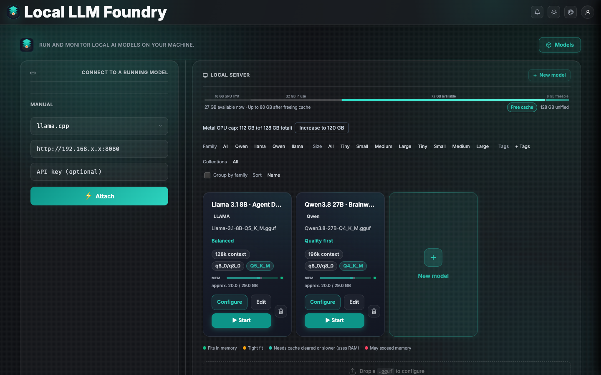

**Details**: [Setup wizard](docs/reference/setup-wizard.md)

### llama.cpp + GGUF (the core path)

llama.cpp is the original engine Local LLM Foundry was built around, and GGUF
is its native model format. The app takes the workflow from model discovery to
an evidence-backed launch configuration:

- **First-class GGUF library**: discover GGUFs locally or on Hugging Face,
  import models from common local-tool ecosystems, and keep model metadata,
  quantization, architecture, and lifecycle state together.
- **Header-aware model intelligence**: inspect GGUF metadata and tensor shapes
  without reading the model weights, then use the real architecture and
  quantization data for VRAM estimates and context-fit decisions.
- **Hardware-aware launch controls**: tune context length, GPU offload, KV
  cache precision, batch and parallel slots, MoE CPU offload, Flash Attention,
  RoPE settings, and other llama-server options from Guided or Pro wizard
  controls.
- **Multimodal and speculative decoding support**: pair vision models with
  `.mmproj.gguf` projectors and configure n-gram, built-in MTP, or external
  draft-model workflows with llama.cpp-native KV and draft controls.
- **Managed upstream builds**: inspect release notes and install supported
  rolling `b#####` builds (including beta/nightly-style builds) from the app;
  the picker filters downloads by the host OS, architecture, and backend.
- **Measure before tuning**: run llama.cpp benchmarks and MTP sweeps from the
  Tuning panel, with live throughput, context, slot, GPU, and system telemetry
  in the same dashboard.

### Rapid-MLX Backend (Apple Silicon)

Rapid-MLX is now a first-class inference backend for Apple Silicon. Local LLM Foundry manages its runtime in an isolated environment—no manual Python setup required.

- Engine selection: choose llama.cpp or Rapid-MLX in the Setup wizard; the wizard recommends Rapid-MLX when using MLX-native models.
- Managed runtime: Local LLM Foundry installs, updates, repairs, and rolls back the Rapid-MLX runtime automatically.
- Live telemetry: the dashboard surfaces Rapid-MLX-specific metrics (throughput, context, model info) alongside llama.cpp, with the same UX.

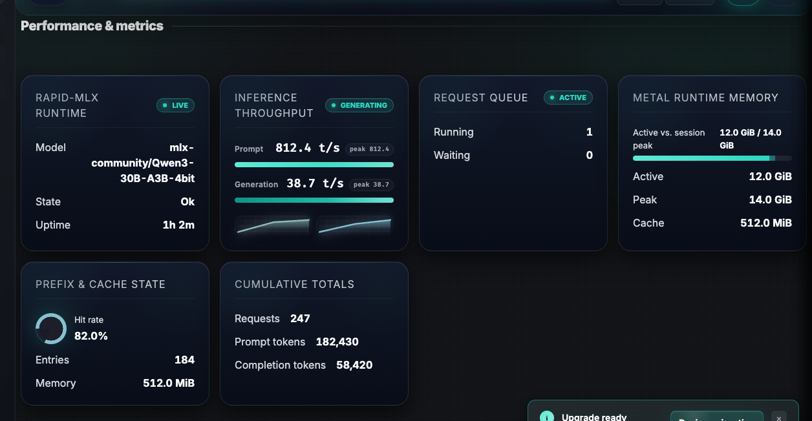

### Live Monitoring Cockpit

Top nav and Server tab show Speed (throughput), context pressure, connection details, active sessions, and model/runtime details in real time. Local sessions read host telemetry directly; remote sessions gain the same depth via the remote agent.

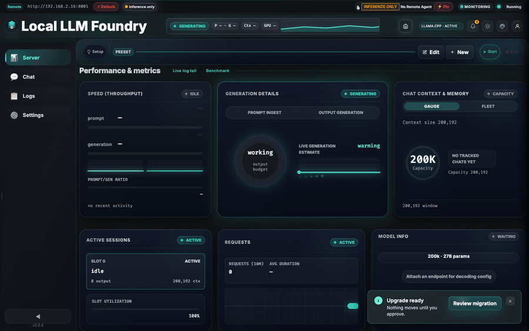

### GPU & System Telemetry

Real-time GPU utilization, temperature, memory, and power, plus CPU and system-level metrics. Designed for local-first and secure remote setups.

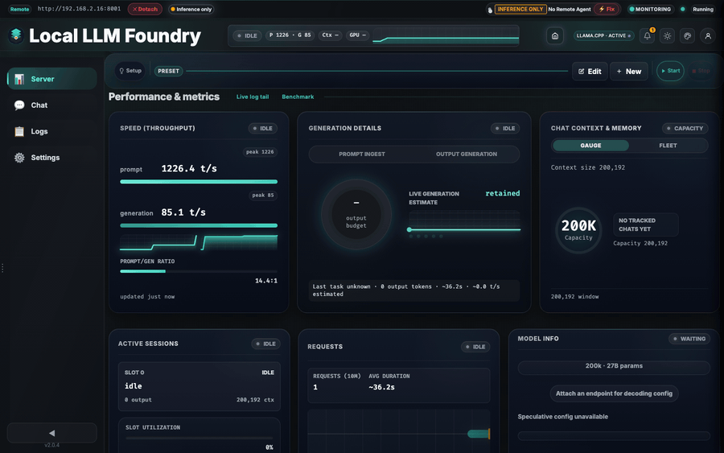

### Chat Workspace & Focus Mode

Chat tabs, prompt controls, telemetry overlays, and logs live next to the monitoring dashboard. Focus mode hides all chrome for a distraction-free view.

- SPA-style navigation and deep linking: seamless transitions between views, browser history support, and stable URLs for conversations (e.g. /chat/:id).
- Multi-session chats with full history and search
- Per-tab prompt and sampling controls
- Focus mode: hide nav, sidebars, and chrome

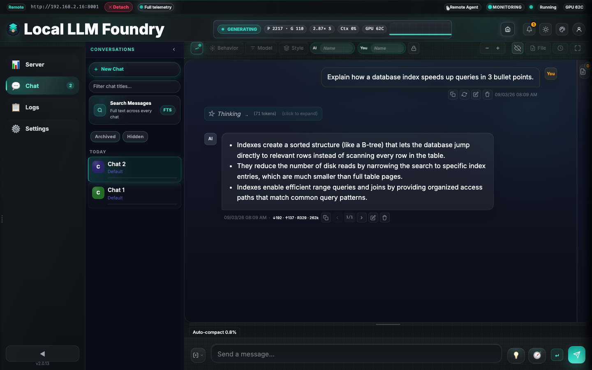
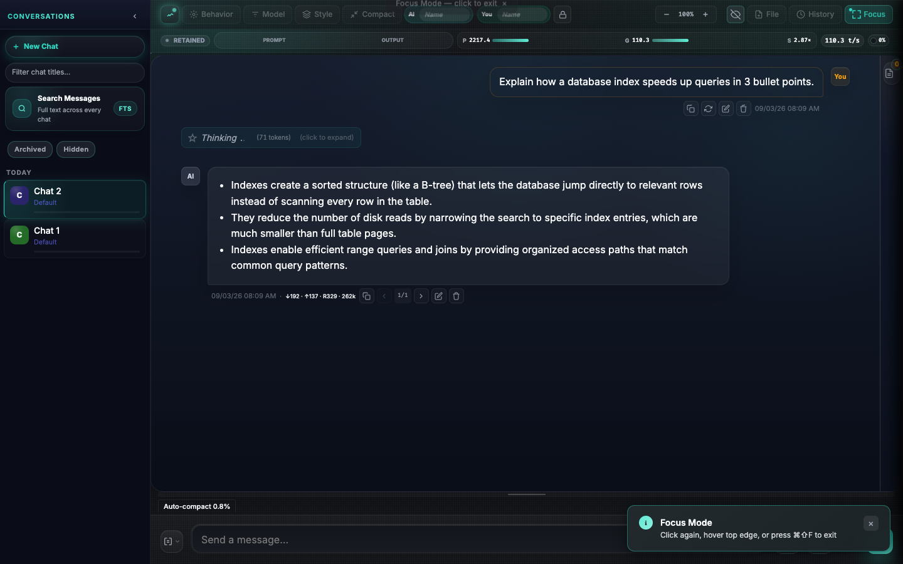

### Chat History Q&A

Ask questions about your conversation in a dedicated sliding panel. It searches message history, pulls relevant context, and streams answers without altering your live chat.

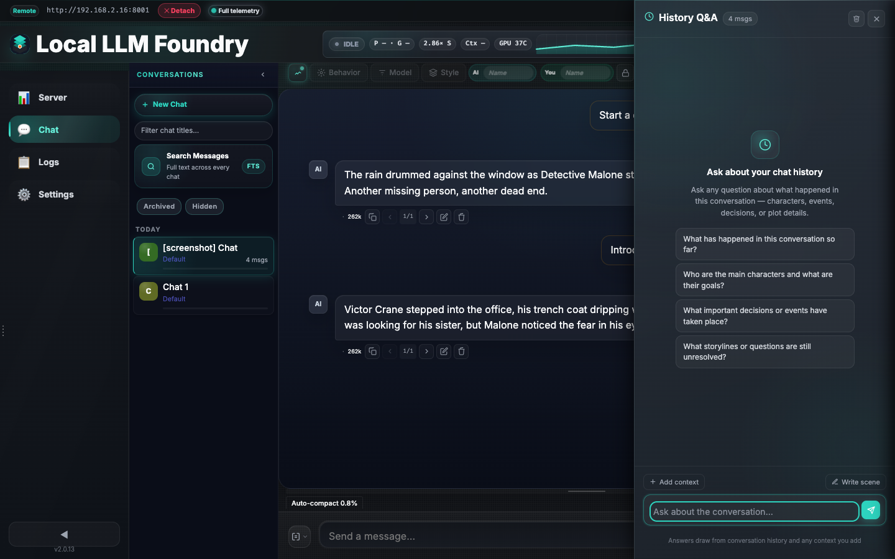

### Guided Generation & Prompt Tooling
A per-tab notes sidebar, AI-generated suggestions, quick guide flows, and director/surprise tools help you steer replies without rebuilding the prompt stack.

- Director mode: type one directive and get four distinct continuation options.
- Surprise mode: arm a beat that triggers at a later reply.

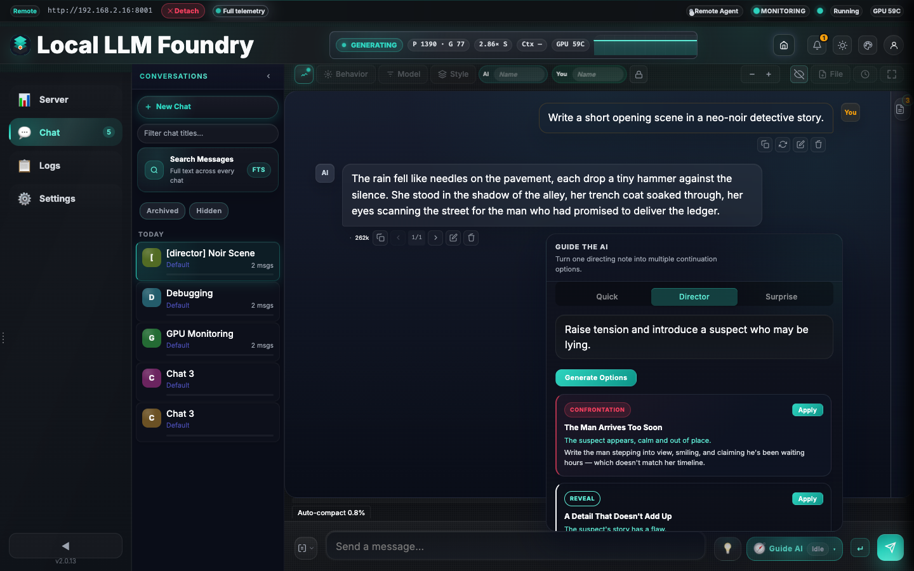

### Appearance & Theming

Four accent palettes pair with dark and light modes for 8 total combinations, switchable from **Settings → Appearance** with instant live updates.

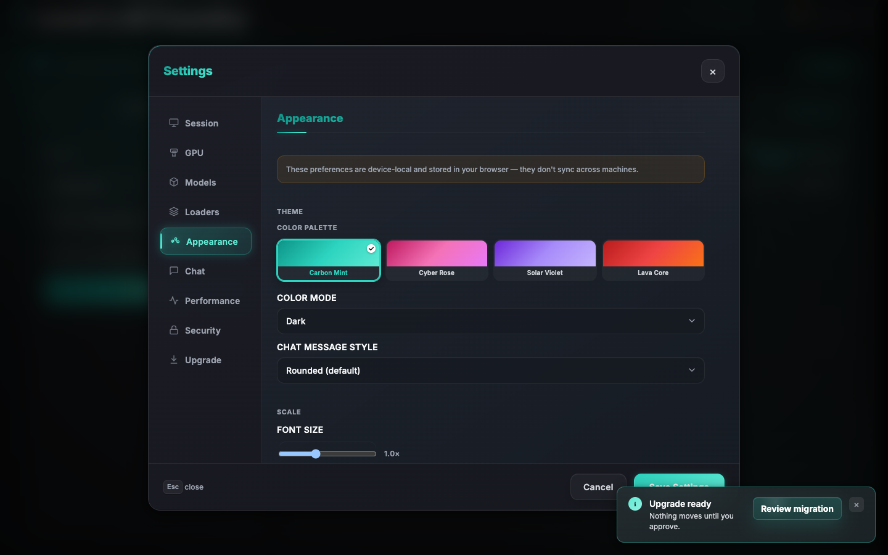

Full palette gallery: [Dashboard Capabilities](docs/reference/dashboard.md#appearance--theming)

### TLS, ACME & mTLS

Built-in TLS with ACME (Let's Encrypt) and mTLS for remote agents. Choose No HTTPS, Self-Signed, Bring Your Own Key, or fully automated ACME with DNS-01 and renewal.

See [TLS Architecture](docs/reference/tls-architecture.md) for full details.

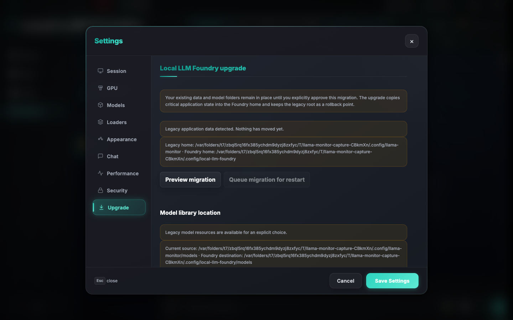

### Start a Server

An integrated setup wizard for discovering, downloading, configuring, and launching a local inference server with llama.cpp or Rapid-MLX. No CLI flags required.

- **Wizard views**: Guided recommendations plus searchable Pro controls with shared canonical state
- **Model sources**:
  - HuggingFace search and curated community picks
  - Third-party import (Ollama, LM Studio, Jan, GPT4All, HF cache)
  - Local GGUF files with VRAM estimates
- **VRAM-aware tuning**: live breakdown bar with auto-size and quant-compare
- **llama.cpp binary management**: browse release notes and auto-download,
  install, update, or roll back supported llama.cpp builds

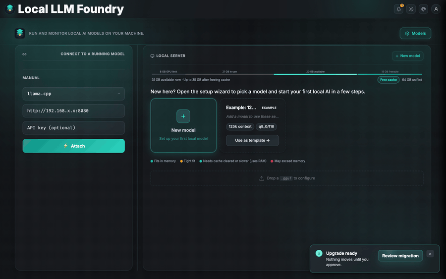

**Details**:
[Setup wizard](docs/reference/setup-wizard.md) ·
[VRAM Estimator](docs/reference/vram-estimator.md)

---

**Monitoring reference**: [Dashboard Capabilities](docs/reference/dashboard.md)  
**Remote telemetry setup**: [Remote Agent](docs/reference/remote-agent.md)  
**Chat and guided generation**: [Chat](docs/reference/chat.md)  
**TLS / ACME / mTLS**: [TLS Architecture](docs/reference/tls-architecture.md)

## Supported Hardware

| Vendor | Tool | Detection |
|--------|------|-----------|
| AMD | `rocm-smi` | Auto-detected |
| NVIDIA | `nvidia-smi` | Auto-detected |
| Apple Silicon | `mactop` | Auto-detected |
| Apple Silicon (MLX) | Foundry-managed MLX runtimes (Rapid-MLX; MTPLX planned) | Apple Silicon/MLX capability probe; runtime availability shown separately |
| Windows (CPU temp) | `sensor_bridge.exe` | Bundled |

## Installation

Pre-built binaries are available on the [latest release](https://github.com/nmorgowicz-org/local-llm-foundry/releases/latest). To build from source:

```bash
git clone https://github.com/nmorgowicz-org/local-llm-foundry.git
cd local-llm-foundry
cargo build --release
```

## Updating

Local LLM Foundry includes in-app updates via the dashboard (Settings or header update prompt). No manual download is required.

- On Windows, the update is seamless: the app restarts automatically with the new version.
- On macOS (Apple Silicon) and Linux, the app briefly shuts down and restarts; if it does not restart on its own, relaunch once.
- On Intel Mac (x86_64), in-app updates are not available; download the latest binary manually from GitHub Releases.

## Documentation

- [Dashboard Capabilities](docs/reference/dashboard.md) — Monitoring, telemetry, refresh behavior
- [Remote Agent](docs/reference/remote-agent.md) — Remote host telemetry, SSH setup, agent lifecycle
- [Chat](docs/reference/chat.md) — Chat tabs, guided generation, prompt tooling
- [Navigation](docs/reference/navigation.md) — SPA routing, deep linking, and vendor assets
- [Setup wizard](docs/reference/setup-wizard.md) — Configure, download, and start a server; model discovery; VRAM tuning
- [VRAM Estimator](docs/reference/vram-estimator.md) — Architecture-aware VRAM heuristics
- [Real-Time Communication](docs/reference/realtime-communication.md) — WebSocket schema, polling, network detection
- [API Reference](docs/reference/api.md) — REST endpoints
- [CLI Reference](docs/reference/cli-flags.md) — Supported flags
- [Rapid-MLX Runtime](docs/reference/rapid-mlx-runtime.md) — Managed Rapid-MLX backend, install, update, and diagnostics
- [Cross-Compilation](docs/reference/cross-compilation.md) — Build targets and toolchains
- [Capability Flags](docs/reference/capabilities.md) — Metric capability system

## Development

```bash
cargo run
cargo test
cargo clippy -- -D warnings
cargo fmt
cargo build --release
```

Frontend assets under `static/` are embedded at compile time. There is no Node build step for the shipped app, but the repo uses Node-based tooling for linting, UI tests, and screenshot capture.

## License

MIT
