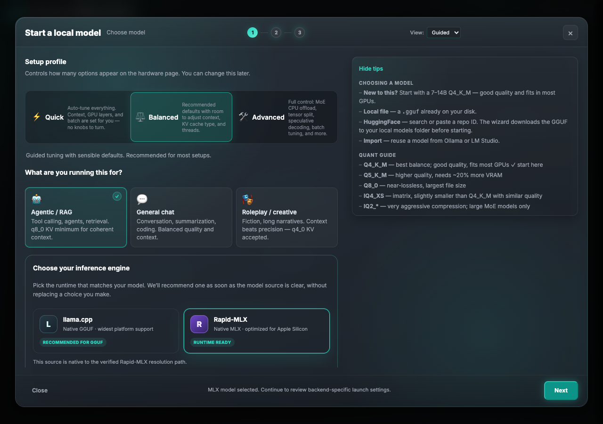
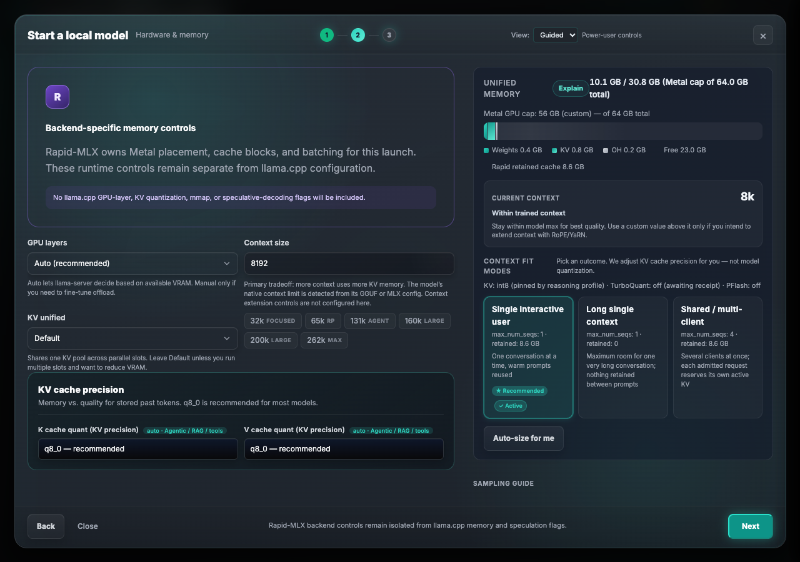

# Local LLM Foundry Spawn Wizard

Foundry is the host product identity. Backend technology names (`llama.cpp`,
`llama-server`, GGUF, MLX, and Rapid-MLX) remain unchanged in wizard choices,
serialized fields, and launch commands.

> **Same wizard, two docs, different audiences.** "Spawn Wizard" and "Setup Wizard" are two
> names for one feature. This doc is the **frontend module architecture**: which `.js` file owns
> which piece of the wizard, and how the codebase is organized. For the **user-facing walkthrough**
> — what each step looks like, what the controls do, and the underlying HF/VRAM/chat-template API
> reference — see [setup-wizard.md](setup-wizard.md) instead.

The Spawn Wizard is the guided flow for creating a model server. It provides:

- Guided disclosure with two workload intents (agentic / RAG / tools and general chat / roleplay)
- Engine selection between llama.cpp and Rapid-MLX
- Model source input (local GGUF, Hugging Face, or import)
- Architecture-aware VRAM breakdown and context fit modes
- Auto-size recommendations and MoE tuning
- Per-backend settings isolation
- Workload scenario mapping (page-1 use-case selection drives backend VRAM policy)

## Preset Editor llama.cpp field parity

The Preset Editor and Spawn Wizard share the canonical field registry in
`static/js/features/spawn-wizard-groups.js`. The generated parity snapshot is
`tests/ui/core/fixtures/llama-config-field-catalog.json`; it records the
persisted key, editor control, wizard status, value type, and Pro category for
each llama.cpp setting. This prevents an editor-only serializer from silently
drifting away from the wizard contract.

The editor's `ctk` and `ctv` controls are binary-capability sourced. `f16`,
`q8_0`, and `q4_0` are shown first, followed by a separator and values
advertised by the selected llama.cpp binary. Unsupported stored values remain
visible and disabled with the capability reason, so an unrelated edit cannot
erase them. Native llama.cpp reasoning effort, format, preservation, and
multimodal-projector offload are separate from Rapid-MLX request-default
reasoning settings. Bundle workload policy is shown only for bundled presets;
flat presets do not gain that field.

## Frontend module map

`static/js/features/spawn-wizard.js` was a single ~5,900-line file through Phase 7. It has
since been decomposed into a shell plus focused feature modules — all under
`static/js/features/`, all imported by the shell (`spawn-wizard.js`) or by each other.
`spawn-wizard.js` still owns the wizard's shared state (`wizardState`), the `dom` lookup
table, step navigation, and the top-level orchestration; everything else below is a
peer module the shell composes.

Module boundaries are behavior-preserving splits, not a redesign — a function's home
module reflects which wizard concern it serves, not when it was written. When looking
for a piece of wizard behavior, use this table first; only fall back to grepping
`spawn-wizard.js` itself for shared state, step-navigation, or orchestration glue.

| Module | Owns |
|--------|------|
| `spawn-wizard.js` | Shell: `wizardState`, `dom`, step navigation/orchestration, shared sizing helpers (`effectiveAvailBytes`, `getModelBytes`, `getSizingArch`, `isUnifiedMemory`), re-exports the Playwright test contract from the modules that now own it |
| `spawn-wizard-format.js` | Shared formatting helpers (`formatCtx`, `formatGB`, `kvBpe`) used across other wizard modules |
| `spawn-wizard-model-card.js` | HF markdown README viewer panel (also used by `models.js`'s HF search panel) |
| `spawn-wizard-third-party-import.js` | Third-party model import: Ollama/LM Studio/Jan/GPT4All/HF-cache discovery |
| `spawn-wizard-chat-template.js` | Chat template auto-install and model-family detection (`detectModelFamily`) |
| `spawn-wizard-hf-origin.js` | HF-origin auto-resolve/widget/confirm cluster — detects which HF repo a local model file came from |
| `spawn-wizard-hf-browse.js` | HF discover/search/quant-advisor/community-picks/quantizer-editor widgets |
| `spawn-wizard-hf-download.js` | HF download panel (start/cancel/complete) plus companion mmproj concurrent download |
| `spawn-wizard-hf-tags.js` | HF tag mapping/normalization and the hardware-step tag-pill UI |
| `spawn-wizard-hardware-model.js` | Hardware-step model header (repo/quant display) and local-model quant-swap discovery flow |
| `spawn-wizard-mmproj.js` | mmproj (multimodal projector) auto-select, dropdown UI, and HF auto-search/manual fetch fallback |
| `spawn-wizard-mtp-draft.js` | llama.cpp GGUF speculative-decoding draft-model matching/checking/rendering (distinct from Rapid-MLX's sidecar flow and the future MTPLX runtime — three unrelated speculative-decoding mechanisms) |
| `spawn-wizard-rapid-mlx.js` | Rapid-MLX backend adapter for the shared wizard (hardware panel fields, parser/reasoning detection, TurboQuant, etc.) |
| `spawn-wizard-context-fit.js` | Context-size quick-picks, native-context warnings, use-case fit warnings |
| `spawn-wizard-autosize.js` | One-click VRAM auto-size (`/api/vram/auto-size`), clamped against the same estimate math the hardware step's live display uses |
| `spawn-wizard-vram-display.js` | Hardware-step VRAM/RAM breakdown rendering; backend-agnostic — renders whatever `/api/vram-estimate` returns, does not branch on engine |
| `spawn-wizard-tuning.js` | Performance-advisor apply/auto-tune/sweep actions |
| `spawn-wizard-binary-prereq.js` | llama.cpp binary prerequisite check & download |
| `spawn-wizard-review-step.js` | Review-step summary card, sampling-field sync, preset save/load (`saveAsPreset`, `buildPresetPayload`), structured params-review table |
| `spawn-wizard-spawn.js` | Final steps: command-preview card, spawn-server submission, canonical payload builders (`buildSpawnPayload`, `launchPortForPayload`, `supportsTunePanelForPayload`) |

A few closely-related modules live alongside these but predate this decomposition and
are not `spawn-wizard-*`-named: `vram-estimate.js` (shared `/api/vram-estimate` request
builder, backend-agnostic), `tune-panel.js` and `evidence-drawer.js` (post-spawn UI),
`attach-detach.js` (server lifecycle, imports `spawn-readiness.js`), and
`spawn-readiness.js` itself. Note `spawn-wizard-spawn.js` has its own internal
`waitForSpawnReadiness` helper that is unrelated to `spawn-readiness.js`'s
function of the same name — a pre-existing naming coincidence, not a shared dependency.

Two forms of intentional circular import exist between wizard modules (safe because
the cross-references only occur inside function bodies, never at module-evaluation
time): `spawn-wizard-context-fit.js` ↔ `spawn-wizard-vram-display.js`, and
`spawn-wizard-spawn.js` ↔ `spawn-wizard-review-step.js` (`buildPresetPayload` /
`buildSpawnPayload` reference each other's owning module).

Playwright's `tests/ui/core/{spawn-wizard,phase7-presets,rapid-phase7-fields}.spec.js`
dynamically `import()` `buildPresetPayload`, `buildSpawnPayload`, `launchPortForPayload`,
and `supportsTunePanelForPayload` from `/js/features/spawn-wizard.js` at runtime — even
though these now live in `spawn-wizard-review-step.js` / `spawn-wizard-spawn.js`, the
shell keeps `export { ... } from './module.js';` re-export lines for the test contract.

## Chat templates — one shared module, three call sites

Chat-template selection UI (Recommended/Check-for-updates/version history/community
fixes, and the "Manage template…" lifecycle modal) lives in a single shared module,
`static/js/features/chat-template-panel.js`, which exports `openChatTemplateManageModal({
tplName, tplRepo, currentPath, onActivated })`, `CT_LABELS`, `repoFromSourceUrl`,
`fetchReleases`, `fetchDiscussions`, `activateRelease`, `checkForUpdate`,
`chatTemplateStatusText`, `chatTemplateHelperText`, and `openCreateFixEditor`. Three
call sites consume it, each owning only its own status-line rendering and the field the
resolved template path gets written into:

1. **llama.cpp Spawn Wizard** — `static/js/features/spawn-wizard-chat-template.js`,
   `_renderChatTemplateStatus()`'s `installed` state. Writes
   `wizardState.model.chatTemplatePath`, sent as `chat_template_file` in
   `buildSpawnPayload()` (`spawn-wizard-spawn.js`).
2. **Rapid-MLX Spawn Wizard** — reuses the *same* `#chat-template-section` DOM (in
   `static/index.html`, shared model-selection step) and the *same*
   `autoInstallChatTemplate()` / `wizardState.model.chatTemplatePath` as the llama.cpp
   wizard (`onModelPathChanged()` in `spawn-wizard.js` calls it for Rapid-MLX
   local/import sources too, not just HF-sourced ones). The resolved path is copied into
   `chat_template_file` inside `buildRapidMlxConfig()` (`spawn-wizard-rapid-mlx.js`).
3. **Preset Editor** — `static/js/features/presets.js`, wired in the modal's chat-template
   field button row (`preset-recommended-chat-template-btn`,
   `preset-check-chat-template-update-btn`, `preset-chat-template-history-btn`, etc. — HTML
   in `static/index.html` around `modal-chat-template-file`).

All three call the same backend endpoints (`/api/chat-template/install-hf`,
`/install-url`, `/active`, `/check-update`, `/releases`, `/activate` — all in
`src/web/api/spawn_wizard.rs`, contract: `GET /api/chat-template/releases?name=...` →
`{ok, releases: [{sha256, revision, source_url, fetch_url, installed_at, file}],
active_sha256}`, `POST /api/chat-template/activate` → `{name, sha256}`). Because the
lifecycle UI itself is centralized in `chat-template-panel.js`, a new history/rollback
action or status state only needs to change one file; each call site's own code is
limited to rendering its status line and wiring the resolved path into its own payload
field, so there's no lifecycle-logic duplication left to drift.

### Runtime coverage — both llama.cpp and Rapid-MLX

The chat-template file (`chatTemplatePath` / `chat_template_file`) is consumed by both
runtimes, via different mechanisms:

- **llama.cpp** (`src/inference/llama_cpp.rs`) passes it directly as the
  `--chat-template-file` CLI flag.
- **Rapid-MLX** (`src/inference/rapid_mlx/mod.rs`) has no equivalent CLI flag. Instead,
  `RapidMlxConfig.chat_template_file` (set from Phase 9 onward) is consumed by
  `build_launch_argv()`, which — when a template file is set — resolves the launch model
  through `model_resolver::create_template_overlay()`: this materializes a small overlay
  model directory (symlinks to the original model files plus the chosen template written
  in as `chat_template.jinja`) and launches Rapid-MLX against the overlay directory
  instead of the original model path. The model files themselves are never copied or
  modified; only the overlay directory is new. `chat_template_kwargs` remains a separate,
  unrelated mechanism (sampling/formatting kwargs passed through to the MLX server, not a
  template file substitution).

## Steps

The Guided redesign (plan: `docs/archive/rapid-mlx/20260806-spawn_wizard_uiux_redesign.md`,
implemented and verified 2026-08-06) collapsed the wizard from six steps down to three.
Each new step folds in the old steps it absorbed:

| Step | Purpose | Absorbs (old numbering) |
|------|---------|--------------------------|
| 0. Model | Profile + use-case selection, engine selection, model source input, model-specific options | old Step 0 (Profile), old Step 1 (Model) |
| 1. Hardware | Context, offload, batching, speculative decoding, VRAM, Rapid-MLX controls, plus the full pre-launch review summary | old Step 2 (Hardware & Memory), old Step 4 (Review) |
| 2. Launch | Network, security, and advanced launch flags; spawn submission and start-up monitoring; preset save/load | old Step 3 (Settings), old Step 5 (Start Server) |

### Step 0: Model

Opens with a profile + use-case selection screen (wizard-step-0), then engine selection and
model source input on the same step:

- **Guided setup**: safe defaults and workload-specific recommendations stay visible, with every applicable control reachable through the canonical All settings drawer.
- **Pro setup**: the power-user view exposes one searchable seven-category surface (Model & compatibility, Memory & context, Performance, Generation & reasoning, Tools & conversation formatting, Network & observability, and Advanced). Switching Guided/Pro relocates the same canonical controls without changing state; modified-only filtering and resolved-default reset operate on that shared state.
Guided disclosure keeps safe defaults visible; every applicable control is reachable in the canonical All settings drawer.
- **Workload cards** map to typed `workload_scenario` values sent to the backend VRAM estimator.

The two visible intents map as follows: `agentic` → `interactive_coding_agent` for tool calling, research, agents, and retrieval; `general` → `general_chat` for conversation, coding, summarization, and creative writing. Legacy `tool_research`, `roleplay`, and `batch_eval` values remain readable for older saved state but are no longer presented as duplicate cards.

Engine selection, model source input, and model-specific options also live on this step. See
[Engine selection](#engine-selection) below.

### Step 1: Hardware

Backend-specific hardware controls, plus the pre-launch review summary (merged in from the
old standalone Review step). The controls shown depend on the selected engine.

For llama.cpp: GPU layers, KV cache types, MoE offload, mlock, threads, speculative decoding, MTP, mmproj, flash attention, fit-to-memory, priority.

For Rapid-MLX: a dedicated `rapid-hardware-panel` is shown with:

- **KV cache dtype**: int4 / int8 / bf16 selection. When reasoning mode is ON, int4 is blocked and KV is pinned to int8 (effective "reasoning profile"). The review summary (merged into the Hardware step) shows "INT4 → INT8 (reasoning profile)" to make the override visible.
- **Retained cache**: 8 GiB (recommended), 16 GiB (retain branches), or Off.
- **Tool-call parser**: Auto (Rapid alias profile) with explicit override options (qwen3, qwen3_xml, qwen3_coder, qwen3_coder_xml, gemma4, hermes, mistral, llama3, deepseek_v31, kimi_k2, glm4, minimax_m2, gpt_oss). Shows "Detected: <value>" hint when the Rapid-MLX profile auto-detects a parser.
- **Reasoning parser**: Auto (Rapid alias profile) with explicit override options (qwen3, gemma4, hy_v3, hy3, deepseek_r1, vibethinker, glm4, gpt_oss, harmony, minimax, ui_tars). Shows "Detected: <value>" hint when the profile auto-detects a parser.
- **Hybrid architecture**: Auto (model/profile detection), Force hybrid, Disable hybrid. For hybrid DeltaNet models (Qwen3-Coder-Next, Qwen3.6).
- **Prefill step size**: 512 (qualified text default), 1024/1536 (vision fallback).
- **TurboQuant mode**: None (standard), K8V4, V-only.
- **Reasoning mode**: Toggle ON for reasoning models (pins KV to int8).
- **Web UI availability**: Auto, On, Off.

### Presentation descriptors and setting state registry

Both engines' Hardware-step controls are declared once, in `static/js/features/spawn-wizard-groups.js`,
as a flat table of `{ id, loader, tier, quickValue }` rows keyed by DOM control id. This
registry — not the DOM's own layout — is the source of truth for two independent behaviors:

The legacy `applyProfileVisibility()` Quick-tier disable loop and profile persistence path are
retired. Guided keeps applicable controls reachable through the canonical drawer; `profile` remains
`balanced` only as a backward-compatible payload field and never overwrites explicit edits.
- **`spawn-wizard-ia.js`**'s `createWizardIA()` factory relocates non-quick controls into
  collapsible, tier-labelled `
` groups (grouped under supersections, e.g. "Advanced
  tuning"), open by default at-or-above their own tier and collapsed below it. Each loader gets
  its own `createWizardIA()` instance — `spawn-wizard-mlx-ia.js` for Rapid-MLX,
  `spawn-wizard-llama-ia.js` for llama.cpp — so the two loaders' groups never cross-toggle each
  other even though their `
` elements share the `mlx-wiz-group` class (each instance
  scopes its `applyTierVisibility()` query to its own private container).

  A group can either be built from scratch (a fresh `
` assembled from its listed
  `controls[]`) or relocate an existing, already-wired element via `group.prebuiltId` — used
  for llama.cpp's speculative-decoding block (`#spawn-spec-details`), which has its own internal
  conditional-visibility logic (draft-KV rows, draft-model path) that the generic group-builder
  doesn't need to re-derive.

Three invariants govern the registry and hold regardless of which loader or UI surface reads it:

- **I1 — tier never hides a control.** A control's tier only changes its *default* disclosure
  (open/closed, or Quick-tier disabled/enabled) — every control remains reachable on every
  profile. There is no tier that removes a control from the DOM or blocks a user from finding it.
- **I2 — every Quick-tier control carries a `quickValue`.** Since Quick disables the control
  and writes this value, an entry without one would silently leave the field at whatever
  stale value it last held. `assertQuickValueCoverage()` in `spawn-wizard-groups.js` enforces
  this at load time; `validate-wizard-groups.mjs` (npm script `validate-wizard-groups`) enforces
  it offline in CI.
- **I3 — Advanced tier means "needs a reason."** A control is `tier: 'advanced'`, not
  `'balanced'`, only when changing it away from its default requires understanding a real
  tradeoff (e.g. MoE CPU-offload placement, prompt-cache RAM bounds) — not merely because it's
  less commonly touched.

### Step 1 UX: sticky header, locked rows, decision cards, changed-count badges

The Guided redesign (plan: `docs/plans/20260806-spawn_wizard_uiux_redesign.md`) adds four
presentation-layer behaviors on top of the control-tier registry above. None of these change
serialization — they are read-only views over the same DOM ids/state.

- **Sticky context bar**: `#hw-model-header` is `position: sticky; top: 0` inside `.wizard-main`
  (which already scrolls independently of the VRAM sidebar), so the model/quant summary stays
  visible while the rest of the Hardware step scrolls. `renderContextChipRow()`
  (`spawn-wizard-hardware-model.js`) renders a compact chip row into
  `#hw-context-chip-row` inside that header — loader, context size, KV precision, and use-case —
  refreshed on every hardware-state change path (`onHardwareChange()`, `renderEngineSelection()`).
- **Locked effective-value rows (P4 fix)**: for `CONTROLS` entries carrying an `effective` tag
  (a control whose UI selection is silently overridden by a runtime constraint — e.g. reasoning
  mode pinning KV to int8), `applyEffectiveLocks()` (`spawn-wizard-groups.js`) adds
  `.field-effective-locked` to the field, injects an "Effective: X" chip from the
  `EFFECTIVE_COPY` map, and a "Why?" toggle that reveals the field's existing `.field-hint` text.
  Called from `renderEngineSelection()` when Rapid-MLX is selected.
- **Always-open decision cards**: KV cache precision and speculative decoding get static
  `.mlx-native-group` card wrappers (same CSS pattern as the tier-gated accordion groups and the
  preset editor) directly in `static/index.html`, rather than being registered in
  `GROUPS`/`SUPERSECTIONS` — the accordion system auto-collapses by tier, and these two cards are
  meant to stay open regardless of profile. Vision and context-size do not get separate cards:
  vision is covered by the sticky header, and context-size already has its own always-open
  quick-pick UI.
- **"N changed from default" badges**: each `.mlx-wiz-supersection` built by
  `createWizardIA()` (`spawn-wizard-ia.js`) gets a `.mlx-wiz-changed-badge` in its heading.
  `captureDefaults()` snapshots each control's shipped default (`data-wiz-default`) the first
  time the IA builds; `refreshChangedBadges()` compares live values against that snapshot and
  shows "N changed from default" per supersection, recomputed on `input`/`change` events
  bubbling through the IA container. Lets a user tell whether a collapsed advanced-tuning group
  hides any non-default setting without opening it.

The Hardware step's review summary shows the full configuration before launch, including
Rapid-MLX advanced settings (KV dtype, prompt storage, workload scenario, sampling mode,
reasoning mode, Web UI) when applicable. When reasoning mode is ON and requested KV dtype is
not int8, the summary shows "INT4 → INT8 (reasoning profile)" to make the override visible.

### Calibration evidence in Pro review

When a local llama.cpp GGUF is available and the wizard is in Pro view, the
Launch review can check saved Calibration receipts. Exact evidence is labeled
**Measured on this model**. If no exact artifact receipt exists, the wizard may
show **Compatible model evidence** when introspected family/shape,
weight-quantization signature, hardware/workload, and normalized runtime
capabilities match; a different llama.cpp build is shown as a warning. A
family/shape match with a different weight quantization is shown only as
**Related model evidence**, requires an explicit confirmation, and is never an
automatic recommendation. Candidates are applied through the existing wizard
controls/events, not a parallel calibration state object.

The optional **Calibrate this model** action is available only after the local
path is known and the wizard preset has been saved. It queues a bounded
llama.cpp job without blocking ordinary spawn. Progress remains visible in the
global notification center after the wizard closes. Rapid-MLX never consumes
llama.cpp calibration evidence.

### Step 2: Launch

Network, security, and advanced launch flags, followed by spawn submission and start-up
monitoring. The expandable **Full config** review is the canonical launch summary:
llama.cpp rows identify requested and estimator-effective values; Rapid-MLX rows identify
requested values and runtime-effective command-preview evidence. Preset save/load options
are available here.

## Engine selection

The wizard supports two inference backends:

- llama.cpp — native for GGUF models
- Rapid-MLX — optimized for MLX-ecosystem models on Apple Silicon

Engine selection appears on Step 0 (Model) as two cards.

The wizard:

- Prefers llama.cpp by default.
- Automatically recommends Rapid-MLX when the chosen model source is native to it.
- Allows the user to override the recommendation (choice is preserved).

### When Rapid-MLX is recommended

The wizard calls `/api/rapid-mlx/recommend` after:

- a model source or file is selected,
- a HF repo is entered (with explicit Rapid-MLX engine),
- the engine is changed.

The endpoint uses `recommend_backend()` (src/inference/backend.rs) which makes a recommendation based on:

- the classified artifact type (see below),
- whether Apple Silicon is detected locally,
- whether a compatible Rapid-MLX runtime is available.

Recommendation outcomes:

- GGUF file or GGUF inventory
  - Recommended: llama.cpp. Reason: "GGUF runs natively with llama.cpp."
- MLX directory, authoritative Safetensors, Rapid-MLX HF repository, Rapid-MLX alias:
  - Not Apple Silicon:
    - State: platform_unavailable
    - Rapid-MLX card becomes visually "unavailable"; user can still attach a remote Rapid-MLX endpoint.
  - Apple Silicon, runtime not installed:
    - State: runtime_required
    - Wizard blocks next step; message instructs user to install from Settings.
  - Apple Silicon, runtime available:
    - Recommended: Rapid-MLX.
    - If the user hasn't explicitly chosen an engine, Rapid-MLX is auto-selected.
- Unknown source:
  - State: manual_selection
  - User must pick an engine after defining the model source.

### Artifact classification

The wizard classifies the selected artifact (spawn-wizard.js:classifyWizardArtifact):

- gguf:
  - path or hfFile ends with .gguf, or quant file list contains a .gguf file.
- authoritative_safetensors:
  - model source kind is "authoritative_safetensors" (from a typed library entry).
- rapid_mlx_alias:
  - model source kind is "alias" (e.g., HF-style alias name resolved by Rapid-MLX).
- rapid_mlx_hf_repository:
  - model source kind is "hugging_face_repo" (Rapid-MLX managed HF repository reference).
- mlx_directory:
  - model source kind indicates MLX directory.
- unknown:
  - none of the above.

The classification is used both by the UI (to show appropriate hints) and by the recommendation endpoint.

## Rapid-MLX wizard UX

When Rapid-MLX is selected, the wizard adapts the Model and Hardware step UI:

- Model source description:
  - Switches to "Choose a validated MLX directory or a Rapid-MLX Hugging Face repository."
- Local model card:
  - Label changes to "Select local MLX model".
  - Description: "Browse to a validated MLX model directory."
  - Browse button switches to directory mode instead of GGUF-only.
- HF source card:
  - Description: "Enter a Rapid-MLX-compatible Hugging Face repository ID."
  - For Rapid-MLX, entering a repo ID is sufficient (no GGUF file picker).
- Import source card:
  - Hidden when Rapid-MLX is selected (Rapid-MLX does not support the import path).
- Hardware step:
  - llama.cpp-specific controls (GPU layers, KV cache types, MoE offload, mlock,
    threads, speculative decoding, MTP, mmproj) are hidden.
  - A Rapid-MLX-specific panel (rapid-hardware-panel) is shown for backend-specific
    configuration, keeping its settings isolated from llama.cpp flags.

- Launch guard:
  - Model-step validation:
    - Blocks if Rapid-MLX is selected but not Apple Silicon.
    - Blocks if Rapid-MLX is recommended-ready but a GGUF was chosen under it;
      instructs switching engines or choosing a validated MLX source.
    - Blocks if a Rapid-MLX-specific model source (alias, HF repository, MLX directory)
      is used under llama.cpp; instructs switching to Rapid-MLX engine.

## Runtime install and upgrade

The Rapid-MLX runtime is managed by Llama Monitor. The wizard does not ship its own installer;
it relies on the runtime management APIs documented in rapid-mlx-runtime.md.

Wizard behavior tied to runtime state:

- On open:
  - Calls `/api/rapid-mlx/runtime/status` and platform-info.
  - If Apple Silicon and runtime is active, the Rapid-MLX card shows "Runtime ready".
  - If Apple Silicon but runtime is missing, it shows "Runtime setup required".
  - On non-Apple Silicon, the card is marked "Local launch · Apple Silicon only".
- Model-step validation:
  - If Rapid-MLX is selected but runtime_required:
    - User cannot proceed; hint points to Settings → Rapid-MLX to install a version.
- Engine badge:
  - Displays one of:
    - "Runtime ready"
    - "Runtime setup required"
    - "Local launch · Apple Silicon only"

The user installs or upgrades the runtime from Settings, using the managed runtime
UI (version picker, channel selection, job polling). After a successful install,
the wizard reflects the new runtime-ready state.

## HF alias support

Rapid-MLX integrates HF-style aliases. These are human-readable model names (for
example, "Qwen2.5-0.5B-Instruct") that Rapid-MLX can resolve to the correct source
repository and revision.

Wizard behavior:

- When a Rapid-MLX model source has kind "alias" in `rapidMlxSource` or
  `localMeta.model_source`, `classifyWizardArtifact()` classifies it as `rapid_mlx_alias`.
- The recommendation endpoint treats this as native to Rapid-MLX:
  - If runtime is compatible and platform supports it, it auto-selects Rapid-MLX.
  - If the user attempts llama.cpp, the validation step blocks with:
    "This typed model source requires Rapid-MLX. Switch engines to continue."
- Alias-based models behave the same as other Rapid-MLX-native sources for VRAM
  estimation, hardware panel rendering, and launch.

## VRAM estimator

The spawn wizard uses the backend VRAM estimator as the single source of truth; there
are no local VRAM formulas.

- The wizard sends requests to `/api/vram-estimate` via `scheduleEstimate()`
  in vram-estimate.js.
- `buildEstimateBody()` sets:
  - `backend: "rapid_mlx"` when Rapid-MLX is selected.
  - `backend: "llama_cpp"` by default.
- The backend returns a normalized breakdown (weights, KV cache, overhead, free)
  for the selected backend.

### Workload scenario

The page-1 use-case selection (agentic / general / roleplay) maps to a `workload_scenario`
string sent to the VRAM estimator via the `/api/vram-estimate` endpoint. The estimator
uses this to determine memory policy:

- `interactive_coding_agent` — coding agent workload, 80% priority, 128K planning context, 32K retained cache. Default when no explicit selection.
- `general_chat` — standard chat, moderate context, 32K planning context, 8K retained cache.
- `roleplay_storytelling` — long-context narrative, 64K planning context, 32K retained cache.

The workload scenario also affects TurboQuant eligibility, MTP eligibility, parallel
slot recommendations, and the recommended KV dtype.

Behavior per backend:

- llama.cpp:
  - Uses GGUF-introspected architecture, layer counts, quantization, MoE settings.
  - Reflects GPU layers, context size, KV cache type, speculation, mmproj, etc.
- Rapid-MLX:
  - Uses Rapid-MLX-specific memory modeling based on the selected model.
  - Incorporates workload_scenario for memory policy (KV dtype, retained cache, TurboQuant).
  - Reflects backend-specific overhead and any Rapid-MLX-native memory considerations.

The VRAM bar and side panel always use the same visual layout regardless of engine,
but the underlying numbers differ because the `backend` field is respected server-side.

### MLX VRAM for Hugging Face downloads

When browsing models on the HuggingFace tab (Step 0, Model), the wizard shows VRAM estimates
for MLX models directly on each model card:

- **VRAM bar**: Shows the estimated VRAM required to run the model, based on the
  selected quantization (INT4/INT8/BF16). The VRAM estimation uses the backend
  `/api/vram-estimate` endpoint with the model's GGUF/MLX metadata.
- **Context pills**: Show the native context ceiling from the model's metadata.
  Selecting a context pill triggers a VRAM recalculation.
- **Format badges**: Display the model format (MLX, GGUF, etc.) based on HF tags
  and repository analysis.
- **Quantization pills**: Show available quantization levels with purple MLX-themed
  styling. Clicking a quant pill updates the VRAM estimate.
- **Download button**: Appears on MLX model cards; initiates the download and
  validates the model directory after download completes.

## Hugging Face model search

The Spawn Wizard integrates a full Hugging Face model search and discovery interface
on the HF tab (Step 0, Model). This replaces the simple repo ID input with a rich search
experience:

- **Discovery scopes**: Users can filter models by scope (e.g., MLX, GGUF, All).
  Scope toggles are additive (MLX + GGUF + All) with platform-smart defaults.
- **Sorting**: Models can be sorted by downloads, likes, or creation date.
- **Categories**: Models are categorized (e.g., text-generation, image-text-to-text).
- **Quantization-only filter**: A "Quants only" toggle filters to quantized models.
- **Format badges**: Each model card shows a format badge (MLX, GGUF) based on
  repository tags and analysis.
- **Lineage cards** (Phase 8B2): Model cards display lineage information, showing
  the model's ancestry (base model, quantization source, etc.) and qualification
  badges (verified quantizer, community-verified, etc.).
- **CommunitySourceCatalog** (Phase 8A): The wizard integrates the community source
  catalog which provides HF qualification and identity information for models. This
  allows the wizard to show author roles, quantizer verification status, and
  community-qualified model information.

## CommunitySourceCatalog integration

The CommunitySourceCatalog (Phase 8A) provides structured information about model
sources, authors, and quantizers from Hugging Face:

- **Author roles**: Identifies model authors vs. uploaders vs. quantizers.
- **Quantizer verification**: Shows whether a quantizer is verified (by the community
  or the model author).
- **Qualification badges**: Models receive badges based on community verification
  and lineage.
- **Local MLX introspection**: For locally downloaded MLX models, the wizard performs
  introspection of the model directory to extract metadata (config.json, weight files,
  etc.) and display VRAM estimates.

This catalog is consumed by the Spawn Wizard's HF tab and the models inventory view
to provide richer model information than raw HF API data alone.

## Backend-aware settings

The wizard isolates settings per backend:

- llama.cpp-only settings (hidden under Rapid-MLX):
  - GPU layers (-ngl)
  - KV cache types (ctk/ctv)
  - MoE CPU offload (-n-cpu-moe)
  - mlock, threads, threads-batch
  - Speculative decoding and MTP controls
  - mmproj projector selection
  - Flash attention, fit-to-memory, priority
- Rapid-MLX-only settings:
  - Exposed via a dedicated Rapid-MLX hardware panel
  - No llama.cpp flags; Rapid-MLX models do not send llama.cpp args.
  - Includes KV dtype, retained cache, parser overrides, hybrid mode, reasoning mode, TurboQuant, Web UI.

This ensures generated launch commands only include parameters valid for the chosen backend.

## Model sources and sampling modes

Rapid-MLX presets store a typed model source rather than relying on a display path.
Supported sources include a local MLX directory, a Hugging Face repository and revision,
an alias, an authoritative Safetensors conversion source, and a GGUF source that is retained
for migration but shown as llama.cpp-only. Older Rapid-MLX presets are migrated to the typed
source when loaded or saved; the legacy `model_path` is not retained as a second identity.
Unknown future source kinds are preserved for editing/export but cannot launch until the
installed Llama Monitor version understands them.

Sampling choices come from one backend API catalog. Each mode includes its stable ID,
source/provenance, workload badges, and backend field coverage. The catalog always includes
Model/author default (omit sampler defaults) and Custom (preserve user-entered values), in
addition to applicable curated family modes. Explicit request values take precedence over a
selected mode; explicit `0` and `false` remain explicit values rather than being replaced by
defaults.

For llama.cpp, supported selected defaults become launch defaults exactly once. Rapid-MLX
sampling defaults remain informational until the selected runtime's per-field capability
snapshot qualifies them; the wizard does not claim they are active or emit unsupported flags.
